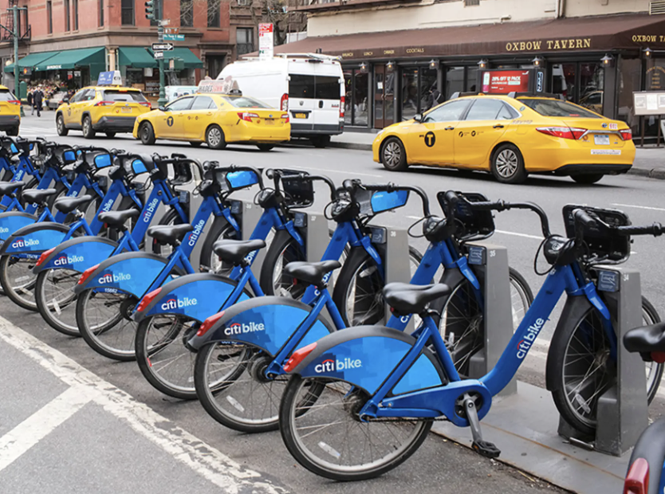

<style>
  h1 {
    text-align: center;
     font-weight: bold;
  }
</style>


  &nbsp;
  
  *Exploring citibike trends across NYC in September 2019*


  &nbsp;
  


  &nbsp;
  
***

## <span style="color: blue;">Motivation for our Project</span>

Increasing transportation costs, congested streets, and subway delays across New York City are pressuring residents to find cheaper and faster means of navigating the Big Apple. The introduction of [Citibike](https://citibikenyc.com/) has had an impact in increasing access to biking as an alternative means of transportation. Biking also has the added benefit of promoting health! However, a critical question emerges: How do NYers in different neighborhoods use citibike, and how do environmental, health, and socioeconomic variables impact ridership and access to rides? 

As public health students grappling with the daily commute in the dynamic landscape of NYC, we are driven by a curiosity to determine the viability and equity of turning to CitiBike as a transportation alternative. Our exploration is multi-faceted, aiming to explore the intricacies of CitiBike use:

   * <u>Geographical Utilization</u>: We seek to explore the patterns of CitiBike usage throughout the diverse neighborhoods of NYC. Understanding where and when these bikes are utilized is key to discerning the impact on urban mobility.
   
  * <u>User Demographics</u>: A crucial part of our exploration involves identifying the demographics of CitiBike users. 
  
  * <u>Health Implications</u>: Beyond transportation statistics, we aim to explore whether CitiBike use is related to health disparities and socioeconomic variables among NYers. This involves exploring associations between CitiBike ridership and bike availability with social deprivation indices, air quality, and being overweight.

Overall, we aim to understand how CitiBike intersects with public health and urban life in NYC.

&nbsp;

```{r library, include = FALSE}
library(tidyverse)
library(shiny)
library(shinyjs)
shinyjs::useShinyjs()
```

***
## <span style="color: blue;">Screencast</span>

  &nbsp;
  
<link here to embed video>
  &nbsp;

***

## <span style="color: blue;">Notes for Reproducibility</span>

<u>Folder structure</u>

The datasets powering this project are quite large (over 1.3 million observations for a single borough in a single month!). In order to successfully host this project via GitHub, we needed to utilize the .gitignore file to store our data. To successfully reproduce this project on one’s own machine, **please create the following two folders in your own local project directory**:

`“citibike”`: this folder stores the individual Citibike data files for each month of 2019 and is needed to create our final composite dataset.

`“citibike_clean”`: this folder stores our final composite dataset with all joined health metrics.

In the `"citibike”` folder, **please download and store the following files from the [Citibike page](https://s3.amazonaws.com/tripdata/index.html)**:

 - `201812-citibike-tripdata.csv`
 - `201901-citibike-tripdata.csv`
 - `201902-citibike-tripdata.csv`
 - `201903-citibike-tripdata.csv`
 - `201904-citibike-tripdata.csv`
 - `201905-citibike-tripdata.csv`
 - `201906-citibike-tripdata.csv`
 - `201907-citibike-tripdata.csv`
 - `201908-citibike-tripdata.csv`
 - `201909-citibike-tripdata.csv`
 - `201910-citibike-tripdata.csv`
 - `201911-citibike-tripdata.csv`
 - `201912-citibike-tripdata.csv`
 - `202001-citibike-tripdata.csv`

<u>Packages required</u> 

In addition to the packages we’ve installed throughout the course of P8105 ([tidyverse](https://www.tidyverse.org/), [ggplot2](https://ggplot2.tidyverse.org/), [plotly](https://plotly.com/r/), [shiny](https://www.rstudio.com/products/shiny/), [shinyjs](https://deanattali.com/shinyjs/), [mgcv](https://cran.r-project.org/web/packages/mgcv/mgcv.pdf), [knitr](https://yihui.org/knitr/), [modelr](https://modelr.tidyverse.org/), [patchwork](https://patchwork.data-imaginist.com/index.html), [viridis](https://sjmgarnier.github.io/viridis/ ), [ggridges](https://wilkelab.org/ggridges/), [flexdashboard](https://pkgs.rstudio.com/flexdashboard/)), we recommend installing the following packages for smooth knitting of any RMD files:

  - [tidygeocoder](https://jessecambon.github.io/tidygeocoder/)
  - [RColorBrewer](https://cran.r-project.org/web/packages/RColorBrewer/RColorBrewer.pdf)
  - [see](https://easystats.github.io/see/)
  - [here](https://here.r-lib.org/)
  - [performance](https://easystats.github.io/performance/)
  - [magrittr](https://magrittr.tidyverse.org/)
  - [pdftools](https://docs.ropensci.org/pdftools/)

&nbsp;


***
  
## <span style="color: blue;">Team Members</span>
  - Laura O'Carroll, lgo2107<br>
  - Courtney Diamond, cjd2195<br>
  - Hyun Jin Jung, hj2660<br>
  - Jesus Luevano, jl5934<br>
  - Kayla Schiffer-Kane, khs2138<br>
  - Haley Zylberberg, hmz2105<br> 
  


