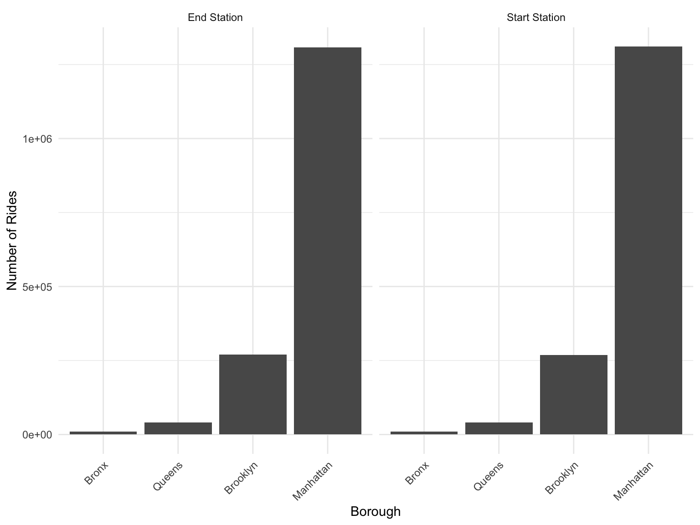
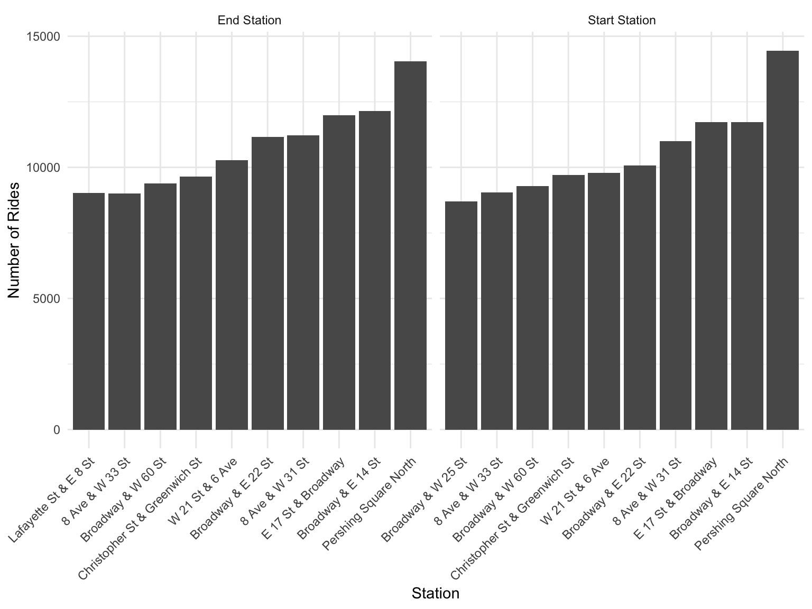
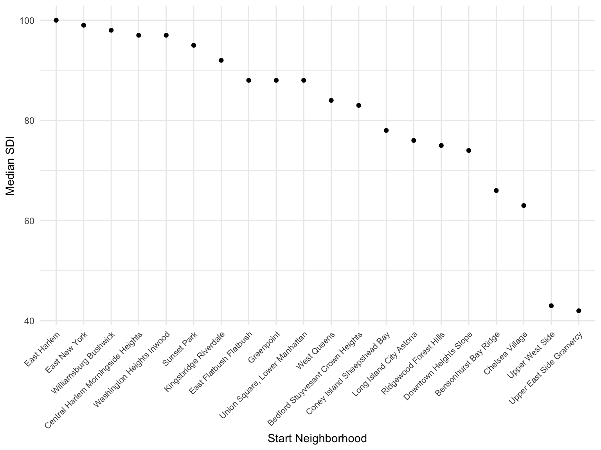
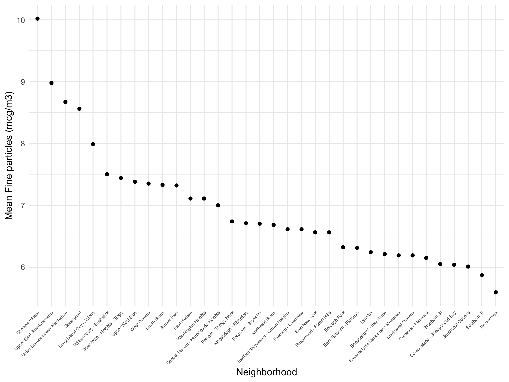
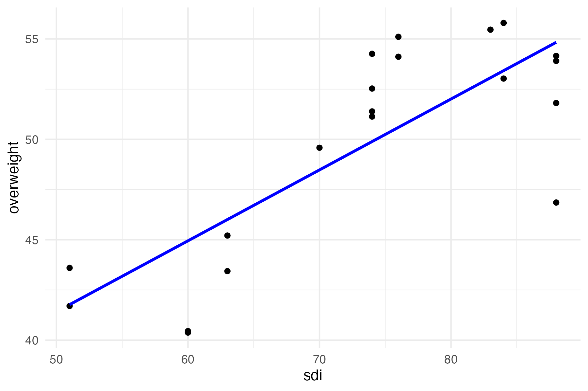
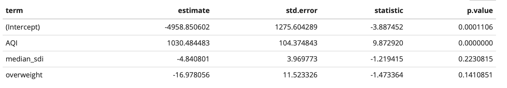
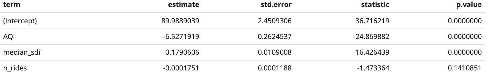
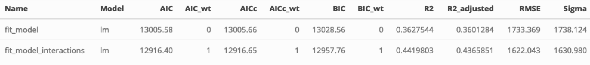

<style>
  h1 {
    text-align: center;
     font-weight: bold;
  }
</style>

  &nbsp;
  
```{r setup, include=FALSE}
library(tidyverse)
library(viridis)
library(plotly)
library(patchwork)
library(pdftools)
library(magrittr)
library(here)
library (DT)

knitr::opts_chunk$set(message = FALSE,
	echo = TRUE,
	warning = FALSE,
	fig.width = 8, 
  fig.height = 6,
  out.width = "90%"
)

library(ggridges)

theme_set(theme_minimal() + theme(legend.position = "bottom"))

options(
  ggplot2.continuous.colour = "viridis",
  ggplot2.continuous.fill = "viridis"
)

scale_colour_discrete = scale_colour_viridis_d
scale_fill_discrete = scale_fill_viridis_d
```


***

## <span style='color: blue;'>Team Members</span>
  - Laura O'Carroll, lgo2107<br>
  - Courtney Diamond, cjd2195<br>
  - Hyun Jin Jung, hj2660<br>
  - Jesus Luevano, jl5934<br>
  - Kayla Schiffer-Kane, khs2138<br>
  - Haley Zylberberg, hmz2105<br> 
  
    &nbsp;

***

## <span style='color: blue;'>Motivation</span>

Increasing transportation costs, congested streets, and subway delays across New York City are pressuring residents to find cheaper and faster means of navigating the Big Apple. The introduction of [Citi Bike](https://citibikenyc.com/) has had an impact in increasing access to biking as an alternative means of transportation. Biking also has the added benefit of promoting health! However, a critical question emerges: How do New Yorkers in different neighborhoods use Citi Bike, and how do environmental, health, and socioeconomic variables impact ridership and access to rides? 

As public health students grappling with the daily commute in the dynamic landscape of NYC, we are driven by a curiosity to determine the viability and equity of turning to Citi Bike as a transportation alternative. Our exploration is multi-faceted, aiming to explore the intricacies of Citi Bike use:

   * <u>Geographical Utilization</u>: We seek to explore the patterns of Citi Bike usage throughout the diverse neighborhoods of NYC. Understanding where and when these bikes are utilized is key to discerning the impact on urban mobility.
   
  * <u>User Demographics</u>: A crucial part of our exploration involves identifying the demographics of Citi Bike users. 
  
  * <u>Health Implications</u>: Beyond transportation statistics, we aim to explore whether Citi Bike use is related to health disparities and socioeconomic variables among New Yorkers. This involves exploring associations between Citi Bike ridership and bike availability with social deprivation indices (SDI), air quality, and being overweight.

Overall, we aim to understand how Citi Bike intersects with public health and urban life in NYC.

  &nbsp;

***
## <span style='color: blue;'>Related Work</span>

After spending time on the Airbnb data sources in class, we were particularly interested in exploring a NYC dataset. As we are public health students, including healthcare professionals, our focus naturally gravitated toward a dataset with potential relevance to the health of New Yorkers. While we evaluated several potential data sources, we were collectively interested in Citi Bike usage data as we recognized its potential to offer valuable insights into the intersection of transportation patterns and public health in NYC.

  &nbsp;

***

## <span style='color: blue;'>Initial Questions</span>

Initially, our ambitions for this project was very grandiose. We wanted to explore all Citi Bike usage patterns throughout 2019. We specifically chose 2019 as we wanted to use the social deprivation index (SDI) score, which was most recently available for 2019. However, we quickly realized that examining data from all of 2019 was too much data (around 1 million rides) and consistently led to problems knitting. Instead we decided to limit our data to one month, September 2019, which had the largest number of rides. The trade-off was that we were unable to examine seasonal trends and ridership. We were particularly interested in rides and ridership during times of year that suggested tourist usage, especially around holidays, but this area of exploration was discarded.

Instead, we focused on questions related to Citi Bike users and geographic utilization. Throughout the evolution of our project, we also decided to emphasize the exploration of health and socioeconomic variables, which introduced a more nuanced layer to our data exploration by providing a health and equity lens. 

We specifically wanted to answer the following questions:

### 1. Geographic Utilization

   a. How many stations are there in each neighborhood and borough of NYC?
   
   b. Where are the most commonly used stations?

### 2. User Demographics

   a. Who is the typical Citi Bike User?

### 3. Health Implications

   a. Are there disparities in Citi Bike stations per neighborhood or in ridership? Is there a relationship to the social deprivation index (SDI)?
   
   b. Are there differences in Citi Bike stations per neighborhood or ridership that is related to obesity? 
   
   c. How do these variables interact? Can we build a model of Citi Bike utilization that integrates disparities, both social and environmental, and also health factors?


***

## <span style='color: blue;'>Data</span>

In the section below we explain our data sources and review our data cleaning and scraping.

### Data Sources

[**CitiBike Data**](https://s3.amazonaws.com/tripdata/index.html): These datasets contain monthly logs of trip, including ride ID, the user's status (subscriber or casual user), trip start/end longitude/latitude coordinates, and the trip start/stop times and duration. 

[**Social Deprivation Index**](https://www.graham-center.org/maps-data-tools/social-deprivation-index.html): The social deprivation index (SDI) is an effort to generate a scoring system of socioeconomic factors using U.S. Census data from the American Community Survey. The final SDI is a composite measure of percent living in poverty, percent with less than 12 years of education, percent single-parent households, the percentage living in rented housing units, the percentage living in the overcrowded housing unit, percent of households without a car, and percentage non-employed adults under 65 years of age. For more details please see the webpage link.

[**Overweight Data**](https://a816-dohbesp.nyc.gov/IndicatorPublic/Subtopic.aspx?theme_code=2,3&subtopic_id=113): This dataset contains publicly available data from NYC regarding the percent of people who are overweight per area. 

[**Air Quality Index Data**](https://data.cityofnewyork.us/Environment/Air-Quality/c3uy-2p5r): The air quality (AQ) data originated from NYC Open Data, contributed by the Department of Hygiene and Mental Health and include air quality indexes measured across boroughs in NYC.

  &nbsp;
  
### Invididual Dataset Imports and Cleaning

#### Citi Bike

The Citi Bike data was a collection of .csv files that we downloaded and merged. We were specifically interested in 2019 as this was when SDI scores were available, so we downloaded the data files from December 2018 through January 2020.  

```{r import citibike, eval = FALSE}
citibike = 
  tibble(
    files = list.files("./citibike/"),
    path = str_c("./citibike/", files)
  ) |>
  mutate(data = map(path, ~read_csv(.x, col_types = cols(
    'end station id' = col_double(),
    'start station id' = col_double()
  )))) |>
  unnest(cols = c(data))

citibike |>
  head() |>
  knitr::kable()
```

We quickly realized that the large sample size limited technical processing feasibility, so we decided to focus on only a month of Citibike data. To do so, we looked at the distribution of number of rides by month. 


As mentioned above, we needed to subset our data to allow for faster processing. We thus chose September as the month analysis due to the high volume of rides in that single month.

Before limiting the data to September, we wanted to get a list of all stations in the dataset for future exploration.

```{r unique_stations, eval = FALSE}
start_station = citibike_df |>
  distinct(start_station_id, start_station_name,
         start_station_latitude, start_station_longitude) |>
  rename(
    station_id = start_station_id,
    station_name = start_station_name,
    latitude = start_station_latitude,
    longitude = start_station_longitude
  )

end_station = citibike_df |>
  distinct(end_station_id, end_station_name,
         end_station_latitude, end_station_longitude) |>
  rename(
    station_id = end_station_id,
    station_name = end_station_name,
    latitude = end_station_latitude,
    longitude = end_station_longitude
  )


stations = rbind(start_station, end_station) |>
  unique() 
  

```


##### Filter to September

Since September is the month of highest usage, we focus on September 2019.

```{r filter_month, eval = FALSE}
citibike_df = citibike_df |> filter(month == 9)
```

In order for the code below to run, we will call in only September here (though we showed the entire code on the [Data Sources](./data_import_clean.html) page).

```{r filter_month to September}
citibike_df = read_csv("./citibike/201909-citibike-tripdata.csv")
```

The cleaning of the Citi Bike data included the following steps:

 * Recoding gender from numeric to text
 * Filtering trip duration to more than 5 minutes but less than 1 day in order to capture true trips taken
 * Including trips that started in 2018 but ended in 2019 and trips that started in 2019 but ended in 2020, so as to include all trips taken in 2019
 * Creating an age at time of trip variable from birth year
 * Creating a trip duration in minutes (as opposed to seconds) variable
 * Renaming variables

A look at the tidied Citi Bike dataframe:
 
```{r tidy citibike}
citibike_df = 
  citibike_df |>
  janitor::clean_names() |>
  mutate(month = as.factor(month(starttime))) |>
  rename(trip_duration_sec = tripduration,
         start_time = starttime,
         stop_time = stoptime,
         user_type = usertype)|>
  mutate(gender = recode(gender,
                         "0" = "Unknown",
                         "1" = "Male",
                         "2" = "Female"),
        trip_duration_min = trip_duration_sec / 60,
        age = 2019 - birth_year
        ) |>
  filter(
    trip_duration_sec >= 300,
    trip_duration_sec <= 86400,
    as.Date(stop_time) >= as.Date("2019-01-01"),
    as.Date(start_time) <= as.Date("2019-12-31")
  )  |>
  select(trip_duration_sec, trip_duration_min, everything()) 

head(citibike_df) |>
  knitr::kable()

```

The September Citi Bike dataframe includes `r nrow(citibike_df)` trips and `r ncol(citibike_df)` variables. The variables in the dataframe are `r names(citibike_df)`. 


#### Social Deprivation Index

The social deprivation index (SDI) dataset was a .csv. We renamed the zipcode variable to be more intuitive. As we were only interested in the entirety of the SDI score, we filtered the data to include `zipcode` and `sdi_score` only. 

* Note: the higher the SDI score, the higher the social deprivation in that area.

```{r sdi_import}
SDI_df <- read_csv("./data/SDI_data/rgcsdi-2015-2019-zcta.csv") |>
  janitor::clean_names() |>
  select(zcta5_fips, sdi_score)|>
  rename(zip=zcta5_fips)
```

  &nbsp;
  
#### Overweight data 

The overweight data was downloaded as .csv files for "Overweight and Obese Adults." We were specifically interested in 2019 as this was when SDI scores were available.

The cleaning of the overweight data included the following steps:

* Converting percent to a numeric variable
* Separating out the high and low confidence intervals of percent
* Renaming time to year
* Filtering data to 2019

```{r overweight_import}
overweight_df =
  read_csv('./data/SDI_data/nyc_overweight_or_obesity_adults.csv') |>
  janitor::clean_names() |>
  mutate(number = gsub("\\*", "", number)) |>
  mutate(number = gsub(",", "", number)) |>
  mutate(number = as.numeric(number)) |>
  mutate(
    percent_low = as.numeric(gsub("^.*\\(\\s*", "", gsub("\\s*,.*$", "", percent))),
    percent_high = as.numeric(gsub("^.*\\,\\s*", "", gsub("\\)$", "", percent))),
percent = as.numeric(ifelse(grepl("\\*", percent),
                                gsub("\\*.*$", "", percent),
                                gsub("\\s*\\(.*", "", percent)))) |>
  rename(year = time) |>
  filter (year == 2019)
```

  &nbsp;
  
#### Air Quality

The air quality (AQ) data was a downloaded from .csv files. 

The cleaning of the air quality index data included the following steps:

* Extracting year from the date variable 
* Filtering data to 2019
* Filtering to geolocation type UHF34, as this is consistent with our other datasets (more on this below!)
* Filtering to annual values, as this dataset also has seasonal values
* Filtering to Fine Particles (PM 2.5) (the original dataset also had Nitrogen dioxide (NO2) and Ozone (O3). There were annual average values for Nitrogen dioxide (NO2) and Fine Particles (PM 2.5) but only summer avereage values for Ozone (O3) levels. For the purpose of only a single value for AQ, we chose to use Fine Particles (PM 2.5) as the air quality index.  

```{r air_quality}
air_quality_df = read_csv("./data/air_quality/Air_Quality_20231126.csv") |>
  janitor::clean_names() |>
  mutate(
    start_date = mdy(start_date),
    year = year(start_date)
  ) |>
  filter(year == "2019")

#Filter to only annual averages of fine particles (PM 2.5) mean measurement, mcg/m3
air_quality_df =   
  air_quality_df |>
  filter(geo_type_name == "UHF34") |>
  filter(time_period == "Annual Average 2019") |>
  filter(name == "Fine particles (PM 2.5)")

```

  &nbsp;

### NYC Neighborhood Data Merging

To combine datasets, they all need to have the same geographic identifier. We decided to use United Hospital (UHF) 34 codes which consists of 34 adjoining zip codes with similar characteristics compiled by NYC Gov. We used UHF 34 (instead of other UHF codes, such as UHF 42) as UHF 34 had the least number of neighborhoods and is therefore more comparable (contains the largest area per neighborhood).

  * For more information about the background behind UHF codes, please see [**here**](https://a816-dohbesp.nyc.gov/IndicatorPublic/data-stories/geographies/). 

We did the following:

1. **UHF 42 to Zipcode** First we converted UHF 42 codes to zip codes, as the overweight dataframe included UHF 42 codes. We found a table that mapped UHF 42 codes to zip codes from a NYC gov  [**pdf**](https://www.nyc.gov/assets/doh/downloads/pdf/ah/zipcodetable.pdf). Below we import this table and tidied it into a dataframe


```{r uhf_zip}
uhf_zip = 
  pdf_text("./data/geocoding/zipcodetable.pdf") |> 
  extract(1)

uhf_zip_df =
  uhf_zip |> 
  str_split("\n") |>
  tibble() |> 
  rename("data" = "str_split(uhf_zip, \"\\n\")") |> 
  unnest("data") |> 
  filter(data != "") |> 
  filter(!row_number() %in% c(1, 2, 51)) |> 
  filter(!row_number() %in% c(1, 2, 10, 22, 33, 44)) |> 
  mutate(data = str_squish(data)) |> 
  mutate(data = str_remove_all(data, "-")) |> 
  mutate(data = str_squish(data)) |> 
  separate(data, into = c("uhf", "rest"), sep = "(?<=\\d\\s)") |> 
  separate(col = "rest", into = c("neighborhood", "zip"), sep = "(?=\\s\\d)", extra = "merge") |> 
  separate(col = "zip", into = c("zip1", "zip2", "zip3", "zip4", "zip5", "zip6", "zip7", "zip8", "zip9"), sep = ",") |> 
  mutate(across(everything(), ~ str_trim(.x))) |> 
  mutate(across(c("zip1":"zip9"), ~ as.numeric(.x))) |> 
  mutate(uhf = as.numeric(uhf)) |> 
  pivot_longer(c(zip1:zip9), names_to = "zip_name", values_to = "zip") |> 
  filter(!is.na(zip)) |> 
  select(!zip_name)
```


2. **UHF 34 to UHF 42**  We imported and cleaned a dataframe that converted UHF 34 to UHF 42 via neighborhood name. The UHF34 source data were found [**here**](https://www.nyc.gov/assets/doh/downloads/pdf/tracking/uhf34.pdf). 

```{r uhf}
uhf_34 = 
  pdf_text("./data/geocoding/uhf34.pdf")

uhf_34_df =
  uhf_34 |> 
  str_split("\n") |>
  tibble() |> 
  rename("data" = "str_split(uhf_34, \"\\n\")") |> 
  unnest("data") |> 
  filter(data != "") |> 
  mutate(data = str_squish(data)) |> 
  filter(!row_number() %in% c(1, 2, 7, 14, 18, 21, 24, 27, 28, 31, 32, 34, 35, 39, 40, 42, 43, 44, 45, 47, 48, 52, 53, 57, 61:75)) |> 
  mutate(data = str_replace(data, "Kingsbridge - Riverdale", "101 Kingsbridge - Riverdale")) |> 
  mutate(data = str_replace(data, "Northeast Bronx", "102 Northeast Bronx")) |> 
  filter(!row_number() %in% c(1,2)) |> 
  mutate(data = str_remove_all(data, "-"),
         data = str_squish(data), 
         data = str_trim(data)) |>
  mutate(data = str_remove(data, "(\\d)+$")) |>
  mutate(data = str_remove(data, "(\\d)+\\s$")) |>
  separate(data, into = c("uhf34", "neighborhood"), sep = "(?<=\\d\\s)") |> 
  mutate(uhf34 = as.numeric(str_trim(uhf34)),
         neighborhood = str_trim(neighborhood)) |> 
  mutate(uhf2 = uhf34) |> 
  separate_wider_position(uhf2, widths = c("1_uhf" = 3, "2_uhf" = 3, "3_uhf" = 3), too_few = "align_start") |> 
  pivot_longer(c("1_uhf":"3_uhf"), names_to = "uhf_name", values_to = "uhf42") |> 
  select(!uhf_name) |> 
  mutate(uhf34 = as.numeric(uhf34),
         uhf42 = as.numeric(uhf42))|>
  mutate(borough = case_when(
    substring(uhf34, 1, 1) == "1" ~ "Bronx",
    substring(uhf34, 1, 1) == "2" ~ "Brooklyn",
    substring(uhf34, 1, 1) == "3" ~ "Manhattan",
    substring(uhf34, 1, 1) == "4" ~ "Queens",
    substring(uhf34, 1, 1) == "5" ~ "Staten Island",
    TRUE ~ "Unknown"  # Handle any other values
  ))
  
```

3. **UHF 34, UHF 42, Zip** We combined UHF 42 and UHF 34 dataframes and zipcode to create a neighborhood crosswalk.

```{r uhf34_42}
joined_uhf_34_42 = 
  uhf_zip_df |> 
  left_join(y = uhf_34_df, by = join_by("uhf" == "uhf42")) |> 
  rename("uhf34_neighborhood" = "neighborhood.y", 
         "uhf42_neighborhood" = "neighborhood.x", 
         "uhf42" = "uhf")

```

  &nbsp;

### Bring Neighborhood to Health Datasets

Now that we have a crosswalk among all location identifiers (UHF 34, UHF 42, and zipcode) used in our datasets, we made sure they all have UHF 34 so they can be merged together later. 

1. Join SDI data to UHF/Zip/Neighborhood data

```{r SDI_zip}
joined_SDI_zip_neighborhood = 
  SDI_df |> 
  filter(zip %in% pull(joined_uhf_34_42, zip)) |> 
  mutate(zip = as.numeric(zip)) |> 
  left_join(y = joined_uhf_34_42, by = "zip")
```

2. Join Overweight data to UHF/Zip/Neighborhood data

```{r overweight_zip}
joined_overweight_zip_neighborhood = 
  overweight_df |> 
  left_join(y = joined_uhf_34_42, by = join_by("geo_id" == "uhf34")) |>
  rename(percent_overweight = percent)

```

3. Join Air Quality data to UHF/Zip/Neighborhood data

```{r air_quality_uhf}
air_quality_df = 
  left_join(air_quality_df, uhf_34_df, by = c("geo_join_id" = "uhf34"))

air_quality_df =
  air_quality_df |>
select(data_value, neighborhood ) |>
 distinct()
```

  &nbsp;

### Bring Neighborhood to Citi Bike Dataset

The Citi Bike data is coded by latitude/longitude To enable merging of Citi Bike data with the health datasets, we need to transform coordinates to zipcode, that can later be easily converted to UHF 34 identifiers.

* To get zipcodes for each  latitude/longitude pair in the Citi Bike data, we used the [tidygeocoder](https://jessecambon.github.io/tidygeocoder/) packager. The full code with details of how that was created [can be found here](latlong_to_zip.html). Here, we import the latitude/longitude to zipcode crosswalk that we generated. 

  * Note: Every Citi Bike entry has a start_latitude/longitude, and end_latitude/longitude. Each row will accordingly have a start_zipcode and end_zipcode. 
  
#### Merge Citi Bike with Zipcode

```{r citibike_zip}
latlong_zip = read_csv('./data/geocoding/citibike_latlong_zip.csv')

citibike_zip =
  citibike_df |>
  left_join(latlong_zip, 
            by = c("start_station_latitude" = "latitude",
                   "start_station_longitude" = "longitude")) |>
  rename("start_zipcode" = "postcode") |>
  left_join(latlong_zip, 
            by = c("end_station_latitude" = "latitude",
                   "end_station_longitude" = "longitude")) |>
  rename("end_zipcode" = "postcode") 

remove(citibike_df)

```

There are `r citibike_zip |> filter(is.na(start_zipcode) | is.na(end_zipcode)) |> nrow()` entries missing either the start or end zipcode.


##### *Missing Zipcodes and Completion*

For the above missing zipcodes, we manually looked up based on latitude, longitude, and station_name what the correct zipcode is. Upon manually exploration, these looked like some data quality issues with the coordinates, but based on the station name we were able to identify the correct zipcode. We stored this work in a .csv on our [github here](https://github.com/courtneyjdiamond/pedalstopatterns.github.io/blob/main/data/geocoding/manual_zipcodes.csv). The code below implements filling in those missing zipcode values. 


```{r manual_zip}
citibike_zip = citibike_zip |>
  mutate(start_zipcode = case_when(start_station_name == "Broadway & W 32 St" ~ 10001,
                               start_station_name == "Cooper Square & Astor Pl" ~ 10003,
                               start_station_name == "William St & Pine St" ~ 10005,
                               start_station_name %in% c("Broadway & W 36 St","Broadway & W 37 St","Broadway & W 38 St","Broadway & W 41 St") ~ 10018,
                               start_station_name == "W 52 St & 6 Ave" ~ 100019,
                               start_station_name %in% c("Broadway & W 41 St","W 43 St & 6 Ave") ~ 10036,
                               start_station_name == "South St & Gouverneur Ln" ~ 10043,
                               start_station_name == "E 47 St & 1 Ave" ~ 10075,
                               start_station_name == "Roebling St & N 4 St" ~ 11211,
                               TRUE ~ start_zipcode)) |>
  mutate(end_zipcode = case_when(end_station_name == "Broadway & W 32 St" ~ 10001,
                               end_station_name == "Cooper Square & Astor Pl" ~ 10003,
                               end_station_name == "William St & Pine St" ~ 10005,
                               end_station_name %in% c("Broadway & W 36 St","Broadway & W 37 St","Broadway & W 38 St","Broadway & W 41 St") ~ 10018,
                               end_station_name == "W 52 St & 6 Ave" ~ 100019,
                               end_station_name %in% c("Broadway & W 41 St","W 43 St & 6 Ave") ~ 10036,
                               end_station_name == "South St & Gouverneur Ln" ~ 10043,
                               end_station_name == "E 47 St & 1 Ave" ~ 10075,
                               end_station_name == "Roebling St & N 4 St" ~ 11211,
                               TRUE ~ end_zipcode))

```

####  Merge Citi Bike with UHF 34 Neighborhood

Now that we have the zipcode for Citi Bike data, we used the zipcode and UHF 34 crosswalk generated above to get the neighborhood variable onto Citi Bike data. 

```{r citibike_neighborhoods}
citibike_zip_neighborhoods =
  citibike_zip |>
  left_join(y = (joined_uhf_34_42 |> select(zip, uhf42_neighborhood, uhf34_neighborhood)),
            by = join_by("start_zipcode" == "zip")) |> 
  rename("start_uhf34_neighborhood" = "uhf34_neighborhood",
         "start_uhf42_neighborhood" = "uhf42_neighborhood") |> 
  left_join(y = (joined_uhf_34_42 |> select(zip, uhf42_neighborhood, uhf34_neighborhood)),
            by = join_by("end_zipcode" == "zip")) |> 
  rename("end_uhf34_neighborhood" = "uhf34_neighborhood",
         "end_uhf42_neighborhood" = "uhf42_neighborhood")

remove(citibike_zip)

```

##### *Missing UHF34*

There were some Citi Bike zipcodes with missing UHF 34, which we explore below: 

```{r missing_uhf}
missing_startuhf = citibike_zip_neighborhoods |>
  filter(is.na(start_uhf34_neighborhood)) |>
  group_by(start_zipcode) |>
  summarize(n = n()) |>
  rename(zipcode = start_zipcode)
  
missing_enduhf = citibike_zip_neighborhoods |>
  filter(is.na(end_uhf34_neighborhood)) |>
  group_by(end_zipcode) |>
  summarize(n = n()) |>
  rename(zipcode = end_zipcode)

citibike_zip_neighborhoods = citibike_zip_neighborhoods |>
  filter(!is.na(end_uhf34_neighborhood) & !is.na(start_uhf34_neighborhood))


```

There are `r missing_startuhf |> pull(n) |> sum()` entries whose start zipcode do not have an associated UHF 34, and  `r missing_enduhf |> pull(n) |> sum()` entries whose end zipcode do not have an associated UHF 34. Manual validation showed these zipcodes are business zipcodes, where a zipcode refers to a small domain of a business. While these could be pinpointed roughly to a UHF 34 neighborhood manually, it is cleaner to simply omit them, as we still retain a substantial dataset size. The resulting dataset has `r citibike_zip_neighborhoods |> nrow()` entries. 

  &nbsp;
  
### Final Dataset: Merge Citi Bike, SDI, Overweight, and AQ

Next we needed to create one large dataframe that merged the citibike data with and each health dataset by UHF 34 neighborhood.

1. Merge SDI and Overweight data 

SDI and overweight are joined together first by UHF 42. 

* Note: There are rows in the overweight data without zipcode that refer instead to borough and city-wide overweight percentages. These are excluded from joining on SDI/citibike data, which function by zipcode that is more granular than borough. These are what is excluded by filtering out null values. 

```{r join_SDI_overweight}
sdi_overweight = 
  merge(joined_overweight_zip_neighborhood, joined_SDI_zip_neighborhood,
                   by.x = c("zip", "uhf42", "uhf42_neighborhood"),
                   by.y = c("zip", "uhf42", "uhf42_neighborhood"),
                   all.x = TRUE)  |>
  select("zip","uhf34","uhf34_neighborhood.x","uhf42","uhf42_neighborhood",
         "sdi_score","percent_overweight", "borough.x") |>
  rename(uhf34_neighborhood = uhf34_neighborhood.x,
         borough = borough.x) |>
  filter(!is.na(zip)) 

remove(joined_overweight_zip_neighborhood)
remove(joined_SDI_zip_neighborhood)
remove(SDI_df)
remove(overweight_df)
```

#### Merge SDI and Overweight data onto Citi Bike

```{r SDI_Overweight_join}
citibike_df =
  citibike_zip_neighborhoods |>
  left_join(y = sdi_overweight,
            by = join_by("start_zipcode" == "zip")) |>
  rename("start_sdi_score" = "sdi_score",
         "start_percent_overweight" = "percent_overweight",
         "start_borough" = "borough") 

remove(citibike_zip_neighborhoods)

citibike_df = citibike_df |>
  left_join(y = sdi_overweight,
            by = join_by("end_zipcode" == "zip")) |>
  rename("end_sdi_score" = "sdi_score",
         "end_percent_overweight" = "percent_overweight",
         "end_borough" = "borough") 
```

#### Merge AQ data onto Citi Bike

```{r AQ_join} 
#Join to final dataframe
citibike_df =
  citibike_df |>
  left_join(y = air_quality_df,
            by = join_by("start_uhf34_neighborhood" == "neighborhood")) |>
  rename("start_aq" = "data_value")

citibike_df = citibike_df |>
  left_join(y = air_quality_df,
            by = join_by("end_uhf34_neighborhood" == "neighborhood")) |>
  rename("end_aq" = "data_value")

```

#### Final Tidy of Citi Bike Data 

A view at the final dataset, as well as overall summary of variables included and any missing values:

```{r final_citibike_tidy}
citibike_df = citibike_df |>
  select(bikeid, user_type, gender, age,
         start_time, stop_time, 
         start_station_latitude, start_station_longitude, 
         end_station_latitude, end_station_longitude,
         start_station_id, start_station_name,
         start_zipcode, start_uhf34_neighborhood,
         end_station_id, end_station_name,
         end_zipcode, end_uhf34_neighborhood,
         start_sdi_score, start_percent_overweight, start_aq,
         end_sdi_score, end_percent_overweight, end_aq, end_borough, start_borough)

head(citibike_df) |>
  knitr::kable()
```

The tidied Citi Bike dataframe includes `r nrow(citibike_df)` trips and `r ncol(citibike_df)` variables named `r names(citibike_df)`.

  &nbsp;
  
### Stations Analysis

For the analysis of station use and availibility (see below), we wanted to understand the full availability of stations, not just the ones used in September. Therefore, we had to join zipcodes and UHF 34 neighborhood to our full station data. We do not run this code here; if you would like to run, please see [Data Sources](./data_import_clean.html).

```{r station_uhf, eval = FALSE}
stations = stations |>
  left_join(latlong_zip, 
            by = c("latitude" ,"longitude")) |>
  rename("zipcode" = "postcode") |>
  mutate(zipcode = case_when(station_name == "Broadway & W 32 St" ~ 10001,
                             station_name == "Cooper Square & Astor Pl" ~ 10003,
                             station_name == "William St & Pine St" ~ 10005,
                             station_name %in% c("Broadway & W 36 St",
                                                 "Broadway & W 37 St",
                                                 "Broadway & W 38 St",
                                                 "Broadway & W 41 St") ~ 10018,
                             station_name == "W 52 St & 6 Ave" ~ 100019,
                             station_name %in% c("Broadway & W 41 St",
                                                 "W 43 St & 6 Ave") ~ 10036,
                             station_name == "South St & Gouverneur Ln" ~ 10043,
                             station_name == "E 47 St & 1 Ave" ~ 10075,
                             station_name == "Roebling St & N 4 St" ~ 11211,
                             TRUE ~ zipcode)) |>
  left_join(y = (joined_uhf_34_42 |> select(zip, uhf34, uhf34_neighborhood, borough)),
            by = join_by("zipcode" == "zip")) 
```


  &nbsp;

***

## <span style='color: blue;'>Exploratory Analysis</span>

  &nbsp;

 *Citi Bike Geographic Analysis*

We made a table of the stations used and available per neighborhood.

```{r load_data, include = FALSE}
stations_df = read_csv("./citibike_clean/stations.csv")
```

```{r station_usage, echo=FALSE}
stations_available = stations_df|>
  group_by(borough, uhf34_neighborhood) |>
  summarize(Stations_Available = n()) 

station_usage = citibike_df |>
  filter(!is.na(end_station_name) | !is.na(start_station_name)) %>%
  select(end_station_name, end_uhf34_neighborhood, 
         start_station_name, start_uhf34_neighborhood,
         start_borough, end_borough) |>
  distinct(
    Neighborhood = coalesce(end_uhf34_neighborhood, start_uhf34_neighborhood),
    Station_Name = coalesce(end_station_name, start_station_name),
    Borough = coalesce(end_borough, start_borough)
    ) |>
  group_by(Borough, Neighborhood) |>
  summarize(Stations_Used = n()) |>
  left_join(stations_available,
            by = c("Borough" = "borough",
                   "Neighborhood" = "uhf34_neighborhood")) |>
  arrange(Borough, desc(Stations_Used)) 

station_usage |> 
  datatable(
  options = list(
    columnDefs = list(
      list(
        targets = "_all",
        render = JS(
          "function(data, type, row, meta) {",
          "if (type === 'display') {",
          "return '<span class=\"dropdown\">' + data + '</span>';",
          "} else {",
          "return data;",
          "}",
          "}"
        )
      )
    )
  ),
  escape = FALSE
)


```
  &nbsp;

We next looked at number of rides per borough.


  &nbsp;

And the 10 most popular starting and stopping stations.


  &nbsp;
  
 *Citi Bike user demographics*


 &nbsp;
 
 *Citi Bike Geographic Utilization with Health Metrics*

  * We used median SDI for our analyses as this more accurately reflects the variation in SDI score across zip codes in a neighborhood. See [here](Exploration.html) for a more detailed description.
  
 &nbsp;

We looked at median SDI and station use/availability by neighborhood.


 &nbsp;

And we looked at percentage overweight and station use/availability by neighborhood


 &nbsp;

 *Citi Bike Ridership and Health Metrics*

* We looked at zipcodes instead of neighborhood in order to have more datapoints to evaluate a trend (we only had 20 neighborhoods.)

We looked at ridership and median SDI by zipcode


 &nbsp;
 
And ridership and percentage overweight at the zipcode level, while also looking at SDI.


&nbsp;

The best part is that we made an interactive [dashboard](https://courtneyjdiamond.shinyapps.io/ExploratoryDashboard/) to visualize the relationship between Citibike and the health variables all together!

&nbsp;

 *Exploration of Health Metrics*

We performed an exploration of of the health variables individually by NYC location. For the full page, [check this out](Exploration.html), but here are some highlights.

Median SDI by Neighborhood in 2019.



Mean Fine Particles by Neighborhood in 2019.



Percent of adults classified as overweight or obese by neighborhood.


Plot of latitute/longitude of NYC by SDI, percentage overweight, and AQI (Mean fine particle (PM 2.5))

```{r , echo=FALSE}
health_plot = citibike_df |>
  select(start_station_latitude, start_station_longitude,
        start_sdi_score, start_percent_overweight, start_aq) |> 
  rename(lat = start_station_latitude, 
         long = start_station_longitude,
         sdi = start_sdi_score,
         overweight = start_percent_overweight,
         aq = start_aq) |>
  unique()

health_plot |>
  mutate(text_label = str_c("SDI: ", sdi, "\nOverweight (%) ", 
                            overweight, "\nAQ (PM25): ", aq)) |> 
  plot_ly(x = ~long, y = ~lat, type = "scatter", mode = "markers",
          color = ~sdi, text = ~text_label)

```

***

## <span style='color: blue;'>Additional Analysis: Modeling</span>

Health Metric Modeling

Before building a model to understanding how health metrics play into Citi Bike usage, we wanted to explore interactions among the SDI and percentage overweight themselves.



Citi Bike use prediction with Health Metric Modeling

Next, we build upon our exploratory analyses by pursuing GLM with two sets of outcome in mind. 

* The first was utilization of Citi Bike in a geographic area, based on health factors in the form of median Air quality, median SDI, and overweight percentages. This utilized a linear model that at first took these three predictors separately into consideration. 


  
* We then created an interaction model that included each of the three individual predictors, but added all possible two-way interactions, and a three-way interaction as we hypothesized that the health, environmental influences, and utilization of biking as a mode of transportation and leisure were related. 

Health Metric Prediction including Citi Bike

We then sought to see if conversely health metrics may be able to be predicted by the other metrics, and Citi Bike utilization. 

* We created three linear models to predict for Air Quality, SDI, and percentage overweight each, using the other factors and number of rides as the predictors. 



  * One such model presented here is that to predict for percentage overweight. 

  &nbsp;

***

## <span style='color: blue;'>Discussion</span>

The overall results of our analyses support our hypothesis that Citi Bike usage and availibility are impacted by disparities in health and equity factors.

  &nbsp;

*Geographic utilization and Integration with Health Variables*

As we expected, station availability and usage varies across the boroughs and within the boroughs. Our September 2019 sample included only one station in the Bronx, 355 stations in Brooklyn, 466 in Manhattan, and 97 in Queens. Of these stations, 276 stations were used in Brooklyn, 380 in Manhattan, and 77 in Queens were utilized. Of all the boroughs, Manhattan saw the highest number of rides. The 10 most popular starting and stopping stations in September 2019 were all in Manhattan.

It was surprising to see only one Citi Bike station in the Bronx. But this was consistent with a Citi Bike expansion into the Bronx shortly after the period we observed for this study, as seen in [this article](https://www.bxtimes.com/first-citi-bike-stations-installed-in-the-bronx-as-part-of-continued-expansion/).


While we saw fairly consistent number of stations used to stations available,the biggest discrepancies in availability and usage were in the following neighborhoods: `r station_usage |> mutate(percent = Stations_Used/Stations_Available * 100) |>  filter(percent < 60) |> pull(Neighborhood)`. While East New York and Williamsburg Bushwick are among the top 5 highest median SDIs, Ridgewood Forest Hills is in the middle. However, these stations may be unreliable as noted in an [ article from 2023](https://comptroller.nyc.gov/newsroom/comptrollers-review-of-citi-bike-finds-worrying-decreases-in-service-reliability-under-lyfts-operation-especially-in-low-income-neighborhoods/), and that this disproportionately impacts low-income areas.

When we specifically examined the relationship between median SDI and Citi Bike station usage/availability in different NYC locations, there didn’t seem to be a discernible pattern. However, the largest number of available stations did appear in areas with lower median SDI (indicating lower social deprivation, i.e., more privileged areas). We did not observe a clear pattern when analyzing this variable by the percentage of overweight individuals.

We then investigated the impact of median SDI and percentage overweight on ridership. We observed a clear downward trend in ridership as median SDI increased, with low ridership also noted in the most privileged zip codes. This might suggest the influence of alternative transportation modes in these areas, encompassing both ends of the SDI spectrum. In contrast to median SDI, we did not observe a ridership dip in the low range of overweight percentage by zip code. Instead, there appeared to be consistent decreases in ridership as the overweight percentage increased, which aligns with expectations. It is likely that individuals with higher overweight percentages are less inclined to use Citi Bikes due to lower fitness levels.

  &nbsp;

*User Demographics*

The most common Citi Bike users were subscribers, males, and those aged 30 years and 50 years.

Most rides were taken by a Citi Bike subscriber compared to a customer, which shows that the Citi Bike system is appealing to New York residents and not just tourists. Our data showed a gender disparity between female and male subscribers, with more male riders than female riders. Across the ages self reported by subscribers, the most common age of riders was 30 years old and then 50 years old. This might suggest that biking is a viable exercise intervention for older adults. 

  &nbsp;

*Modeling*

We first explored the interactions among the health metrics (median SDI and percentage overweight) themselves. We found that for every one-unit increase in SDI, overweight percentage is estimated to increase by 0.194, assuming all other factors remain constant. They are positively correlated, but not very strongly. This suggests that people of lower socioeconomics tend to be more overweight, though correlation does not apply causation.

</u>Citi Bike Use Prediction with Health Metric Modeling</u>

We found that the models had significant Beta statistics, but overall had very variable RMSE values in our cross-validation analyses. We also found the R2 to be low for both. 



</u>Health Metric Prediction including Citi Bike</u>

We found that the models had less variability in RMSE, and higher R2 values than our prior models trying to predict Citi Bike usage. Our most impressive model was to predict for percentage overweight. 


  &nbsp;

*Conclusion*

Our exploration of Citi Bike reveals significant disparities in public investments across NYC. These discrepancies highlight the inequities in resource allocation that have played a role in shaping the diverse landscapes of NYC's neighborhoods. Our research emphasizes the importance of implementing health-supporting interventions, such as creating more opportunities for physical activity and ensuring accessible transportation options. The insights from our findings can provide a valuable roadmap (or bikemap!) for identifying specific NYC neighborhoods and demographics that would benefit from targeted efforts to promote Citi Bike utilization and expansion.
